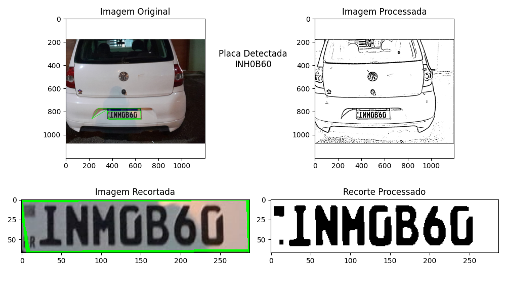

# Reconhecimento e Leitura de Placas de Veículos

Este projeto utiliza técnicas de processamento de imagem e OCR (Reconhecimento Óptico de Caracteres) para identificar e ler placas de veículos em imagens. Com o uso da biblioteca Tesseract OCR, o sistema consegue detectar placas de veículos, processar a imagem para otimizar a detecção de caracteres e extrair o texto da placa. Essa tecnologia é útil em diversos cenários, como controle de acesso em estacionamentos, monitoramento de tráfego e automação de processos de segurança.

## Objetivo

O objetivo deste projeto é desenvolver uma solução automatizada para reconhecimento de placas de veículos com alta precisão. Combinando algoritmos de processamento de imagem e OCR, o sistema pode detectar e ler caracteres em diferentes tipos de placas, incluindo o padrão Mercosul e o modelo tradicional, em condições variadas de iluminação e ruído.

## Link para o Artigo

Para uma descrição detalhada sobre a metodologia e os desafios enfrentados durante o desenvolvimento, consulte o [artigo completo](https://github.com/Gabriellimmaa/reconhecimento-e-leitura-placa-carro-ptBR/blob/main/artigo/Artigo.pdf).

  

